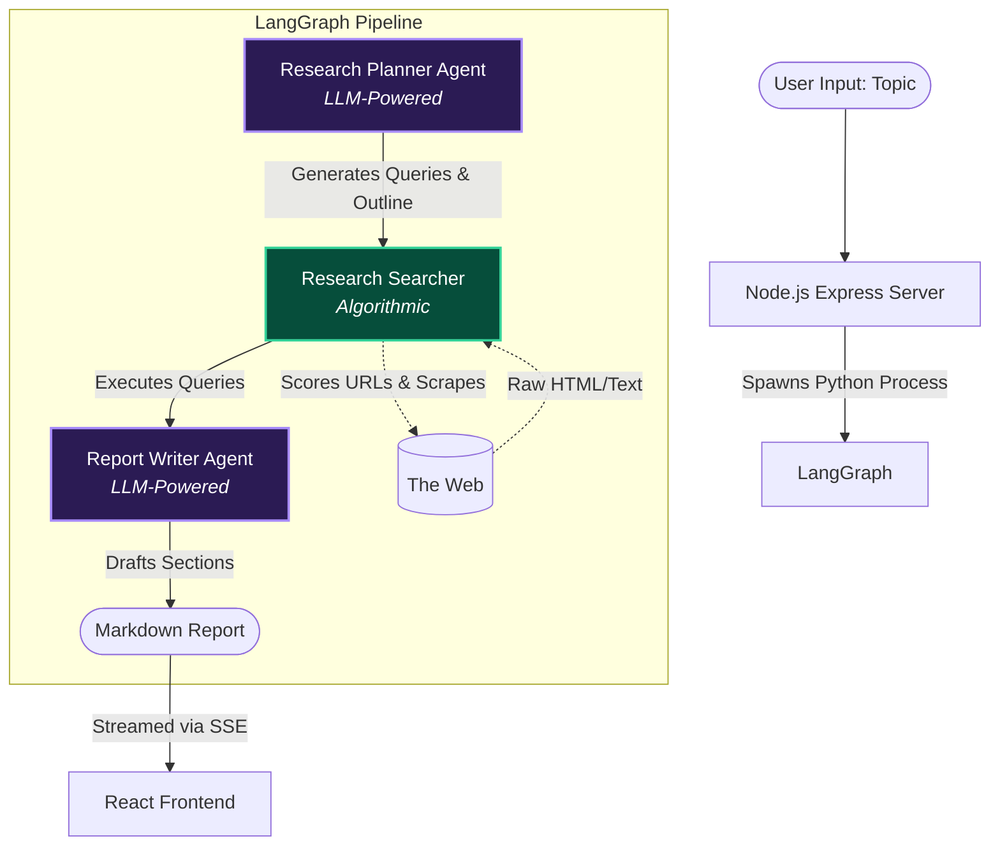

# Deep Research Agent

 <!-- Placeholder, you can update this to an actual screenshot -->

Deep Research Agent is a fully autonomous, multi-agent AI system designed to conduct comprehensive, deep-dive web research on complex topics. Give it a broad topic, and it will independently formulate a research plan, browse the internet, extract relevant data from credible sources, and synthesize its findings into a massive, heavily-detailed Markdown report.

Built with performance and API efficiency in mind, the agent operates entirely on Google's generous **Gemini 3.5 Flash** free tier, enabling extensive research runs at zero cost.

---

## 🌟 Key Features

- **Multi-Agent Architecture:** A specialized trio of Planner, Searcher, and Writer agents working sequentially.
- **Algorithmic Scraping Engine:** Zero-LLM overhead for data collection. It scores URLs for credibility and extracts content efficiently, completely bypassing API rate limits during the heavy lifting phase.
- **Live SSE Streaming:** Watch the agent's thought process and progress in real-time on a beautifully designed React frontend.
- **Resilient Pipeline:** Built-in automatic retry logic gracefully handles rate-limiting (`429 Too Many Requests`).
- **Render Ready:** Fully Dockerized and ready for one-click deployment on Render.

---

## 🏗️ System Architecture

The system follows a streamlined **3-Agent Pipeline** powered by LangGraph. We deliberately removed intermediate synthesis bottlenecks to drastically reduce token usage and improve raw information retention.



### The 3 Core Agents:
1. **Research Planner (`LLM`):** Acts as the strategist. It receives the user's broad topic and generates a specific list of optimized search queries and a structured outline for the final report.
2. **Research Searcher (`Algorithmic`):** Acts as the data gatherer. It mechanically queries the web, evaluates domains for credibility (e.g., heavily weighting `.edu`, Wikipedia, etc.), and scrapes the content. Because this phase uses zero LLM calls, it is incredibly fast and cheap.
3. **Report Writer (`LLM`):** Acts as the author. It absorbs the raw text gathered by the Searcher and autonomously drafts the final structured report section-by-section.

---

## 🛠️ Technology Stack

**Frontend:**
* React + Vite
* Vanilla CSS (Premium Dark Mode UI)
* Server-Sent Events (SSE) for Live Streaming

**Backend:**
* Node.js + Express (Process Manager / API)
* Python 3.11
* LangGraph (Agentic Workflow Routing)
* `google-genai` (Gemini 3.5 Flash)
* `beautifulsoup4` & `requests` (Web Scraping)

**Deployment:**
* Docker (Multi-stage build)
* Render

---

## 🚀 Running Locally

### Prerequisites
- Node.js (v20+)
- Python (3.11+)
- A free Google Gemini API Key from [Google AI Studio](https://aistudio.google.com/app/apikey)

### Setup

1. **Clone the repository**
```bash
git clone https://github.com/avish006/deep-research-agent.git
cd deep-research-agent
```

2. **Install Python Dependencies**
```bash
python -m venv venv
# Windows: venv\Scripts\activate
# Mac/Linux: source venv/bin/activate
pip install -r requirements.txt
```

3. **Install Node/React Dependencies**
```bash
# Setup Backend
cd server
npm install

# Setup Frontend
cd ../client
npm install
```

4. **Run the Application**
Open two terminal windows.

**Terminal 1 (Backend):**
```bash
cd server
npm run dev
```

**Terminal 2 (Frontend):**
```bash
cd client
npm run dev
```
The application will be available at `http://localhost:5173`. Simply paste your Gemini API key into the UI to begin!

---

## ☁️ Deployment (Render)

This repository is 100% configured for a monolithic Docker deployment on Render. The provided `Dockerfile` automatically builds the React frontend, sets up the Python backend, and serves everything cohesively via Express.

1. Create an account on [Render](https://render.com/).
2. Click **New +** -> **Blueprint**.
3. Connect this GitHub repository.
4. Render will automatically detect the `render.yaml` file and handle the complete deployment process.

*(No environment variables are required during deployment. Users supply their own API keys via the web interface).*

---

## ⚠️ Troubleshooting

If you encounter `"429 Too Many Requests"` or your research immediately fails in the Live Traces, it means you have exhausted Google's daily free-tier quota for your specific account. 

**Fix:** Log out of Google AI Studio, log in with a **different Google account**, generate a brand new API key, and paste it into the UI.
